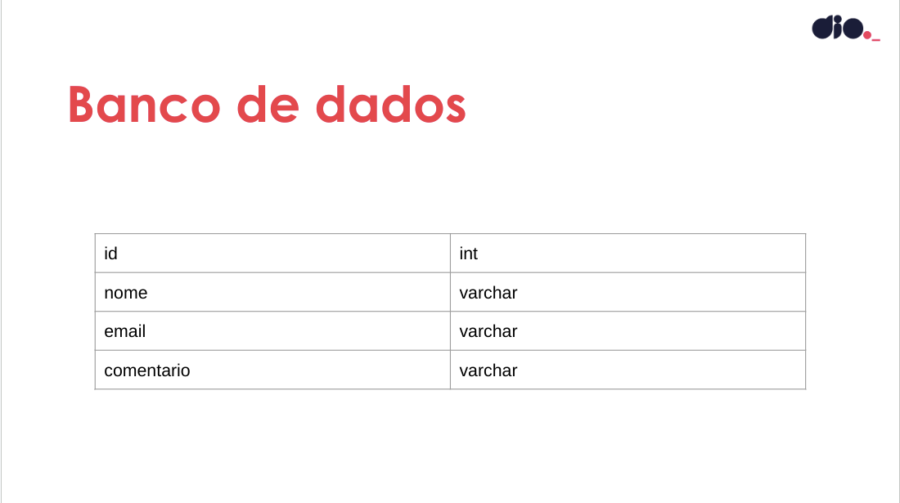

<h1 align="center">Desafio de projeto - Criando um deploy de uma aplicação</h1>

  
  

  <a href="#-projeto">Projeto</a>&nbsp;&nbsp;&nbsp;|&nbsp;&nbsp;&nbsp;
  <a href="#-arquitetura">Arquietura</a>&nbsp;&nbsp;&nbsp;|&nbsp;&nbsp;&nbsp;
  <a href="#-roadmap">Roadmap</a>

  

## Projeto

No desenvolvimento do projeto serão criadas as imagens dos contêineres e serviços necessários no Kubernetes para que a aplicação esteja pronta para produção.

## Arquitetura

Arquitetura das aplicações

  

Banco de dados

  

## Roadmap

- [x] [Subir um Cluster Kubernetes](./setup-cluster/README.md)
- [x] [Preparar as aplicações para serem deployadas](./app/backend/Dockerfile)
- [x] [Preparar o Banco de dados](./app/db/Dockerfile)
- [x] [Testar o fluxo das aplicações](./fluxo-app.md)